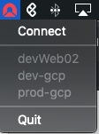

# Getting access from laptop

This guide will take you through the required tools and permissions that need to be in place for you to be able to
operate your own NAIS application directly from your laptop.

## Install [`kubectl`][kubectl]

`kubectl` is a command-line tool used to manage your Kubernetes resources.

Check out the [official documentation][kubectl] for instructions on how to install the binaries.

## Connect to ScaleFT


You can skip this step if your running Windows and connect to NAV through BigIP VPN.


In order to reach our clusters, you have to be connected to the right ScaleFT host. For GCP, it's one host per cluster
(`dev-gcp` and `prod-gcp`), for on-premise it is `devWeb02`.

If you are using a Mac, the easiest method to connect to ScaleFT is through navTunnel which should be installed and
running. You can see the status of your connection by clicking the navTunnel icon. When selecting connect, the login
process will lead you to a ScaleFT credential request which you must approve in order to establish
a connection.



## Setup your [`kubeconfig`][kubeconfig]

The `kubectl` tool uses a `kubeconfig` file to get the information it needs in order to connect to a cluster. We
provide a [pre-made kubeconfig] file with NAV's [clusters](clusters.md).


If you use `utviklerimage` or connect to NAV through BigIP VPN you need to use the kubeconfig under the
Git tag `utviklerimage`. Go to the directory where you cloned kubeconfig and run
```bash
git fetch --all --tags --prune
git checkout tags/utviklerimage
```


`kubectl` will by default look for a file named `config` in the `$HOME/.kube/` folder. This can be overriden by
having the absolute path of the file in the environment variable `KUBECONFIG`.

```bash
export KUBECONFIG="/home/$(whoami)/kubeconfigs/config"
```

The above example can also be added to something like `~/.bash_profile`, or the equivalent in your preferred shell.


If you use cygwin, you need the `KUBECONFIG` to be in Windows style paths rather than unix style paths (e.g.
`C:\dev\kubeconfigs\config` instead of `/cygdrive/c/dev/kubeconfigs/config`)


## Authenticate `kubectl`

### On-premise

When connecting to on-premise clusters, you need to authenticate with Azure AD.

```bash
$ kubectl config use-context prod-fss
Switched to context "prod-fss".

$ kubectl get pods
To sign in, use a web browser to open the page https://microsoft.com/devicelogin and enter the code CR69DPQQZ to authenticate.
```

When prompted like above, go to the address and enter the code. You then log in with your NAV e-mail and password.
When done, `kubectl` will update your `kubeconfig`-file with the tokens needed to gain access to the cluster.

### Google Cloud Platform (GCP)

Before following these steps, make sure your team is enabled for Google Cloud Platform, check 
out [team access] for more information.

First you need to install `gcloud` following the [instructions] for your platform.

Once installed, you need to authenticate with Google using your NAV e-mail.

```bash
$ gcloud auth login
```

Make sure you are connected to the right cluster, and verify that it works.

```bash
$ kubectl config use-context prod-gcp
Switched to context "prod-gcp".
$ kubectl cluster-info
gcp-terraform $ k cluster-info
Kubernetes master is running at https://127.0.0.1:14131
...
```

## Recommended tools

[kubectx](https://github.com/ahmetb/kubectx) - Simplifies changing cluster and namespace context.  
[kubeaware](https://github.com/jhrv/kubeaware) - Visualize which cluster and namespace is currently active.  
[emacs-kubectx-mode](https://github.com/terjesannum/emacs-kubectx-mode) - Switch kubectl context and namespace in Emacs and display current setting in mode line.

[kubectl]: https://kubernetes.io/docs/tasks/tools/install-kubectl
[kubeconfig]: https://kubernetes.io/docs/concepts/configuration/organize-cluster-access-kubeconfig/
[pre-made kubeconfig]: https://github.com/navikt/kubeconfigs
[team access]: ../gcp/getting-started.md#access
[instructions]: https://cloud.google.com/sdk/docs/#install_the_latest_cloud_tools_version_cloudsdk_current_version
