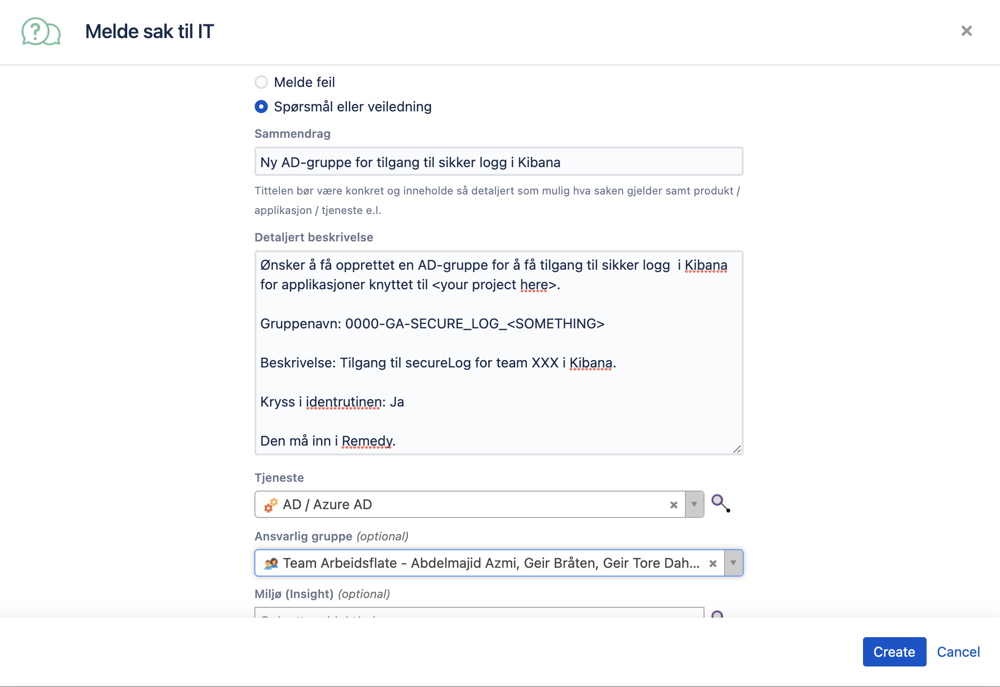

# Logs

## Logging

Configure your application to log to console \(stdout/stderr\), it will be scraped by [FluentD](https://www.fluentd.org/) running inside the cluster and sent to [Elasticsearch](https://www.elastic.co/products/elasticsearch) and made available via [Kibana](https://www.elastic.co/products/kibana). Visit our Kibana at [logs.adeo.no](https://logs.adeo.no/).

If you want more information than just the log message \(loglevel, MDC, etc\), you should log in JSON format; the fields you provide will then be indexed.

## Secure logs

Some applications have logs with information that should not be stored with the normal application logs. To support this a directory for these logs can be mounted in the application, and the content of logs written here will be transferred to separate indices in Elasticsearch.

### Enabling secure logs

Secure logs can be enabled by setting the `secureLogs.enabled` flag in the application resource. See [the nais manifest specification](../../nais-application/nais.yaml/reference.md).

### Log files

With secure logs enabled a directory `/secure-logs/` will be mounted in the application container. Every `*.log` file in this directory will be monitored and the content transferred to Elasticsearch. Make sure that these files are readable for the log shipper \(the process runs as uid/gid 1065\).

The `/secure-logs/` directory has a size limit of 128Mb, and it's the application responsibility to ensure that this limit is not exceeded. **If the limit is exceeded the application pod will be evicted and restarted.** Use log rotation on file size to avoid this.

### Log configuration

Log files should be in JSON format as the normal application logs. Here is an example configuration of JSON logging with a size based rolling file appender in Logback:

```markup
  <appender name="secureLog" class="ch.qos.logback.core.rolling.RollingFileAppender">
    <file>/secure-logs/secure.log</file>
    <rollingPolicy class="ch.qos.logback.core.rolling.FixedWindowRollingPolicy">
      <fileNamePattern>/secure-logs/secure.log.%i</fileNamePattern>
      <minIndex>1</minIndex>
      <maxIndex>1</maxIndex>
    </rollingPolicy>
    <triggeringPolicy class="ch.qos.logback.core.rolling.SizeBasedTriggeringPolicy">
      <maxFileSize>50MB</maxFileSize>
    </triggeringPolicy>
    <encoder class="net.logstash.logback.encoder.LogstashEncoder" />
  </appender>
```

See [logging examples](examples.md) for more information on log configuration.

### Non-JSON logs

If the logging framework used doesn't support JSON logging, it is also possible to use multiline logs in this format:

```text
<iso8601 timestamp> <log level> <message>
<message cont.>
<message cont.>
```

Files on this format must be named `*.mlog`.

### Sending logs with HTTP

If you do not want to have these logs as files in the pod, it is also possible to use HTTP to write logs. POST your log entry as JSON to `http://localhost:19880`

```bash
curl -X POST -d '{"log":"hello world","field1":"value1"}' -H 'Content-Type: application/json' http://localhost:19880/
```

## Overview


## Gaining access in kibana

Once everything is configured, your secure logs will be sent to the `tjenestekall-*` index in kibana. To gain access to these logs, you need to do the following:

### 1 Create an AD-group

To make sure you gain access to the proper logs, you need an AD-group connected to the nais-team. So the first thing you do is create this group.

Go to [Porten (service desk)](https://jira.adeo.no/plugins/servlet/desk/portal/542) and click `Melde sak til IT`. The follow the template below.



### 2 Connect the AD group to your team in Kibana

Your app produces logs based on nais-team. So in order for you to get access to the logs, the AD-group must be linked with the nais team, so whoever is in the AD-group can read all logs produced by apps belonging to the nais-team.

The easiest way to achieve this is to ask in the `#atom` slack channel. And ask them to connect AD-group X to team Y.

### 3 Put people into the AD-group

This must be done by "identansvarlig". For NAV-IT employees, this is `nav.it.identhandtering@nav.no`. Send them an email and ask for access with a CC to whoever is your superior.

For everyone else, the team lead or who ever is their superior should know.

### What can go wrong?

Basically, the one thing that can go wrong here is that the AD-group is not registered in "identrutinen". If this happens, the group cannot be found by "identansvarlig". If this happens, make a new JIRA-ticket to the same people and tell them to transfer the group. Sadly this can take a few days.
