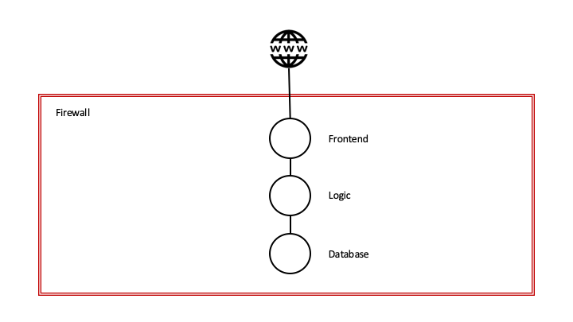
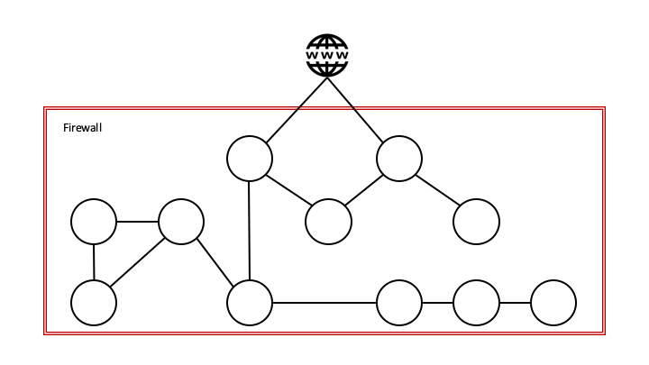
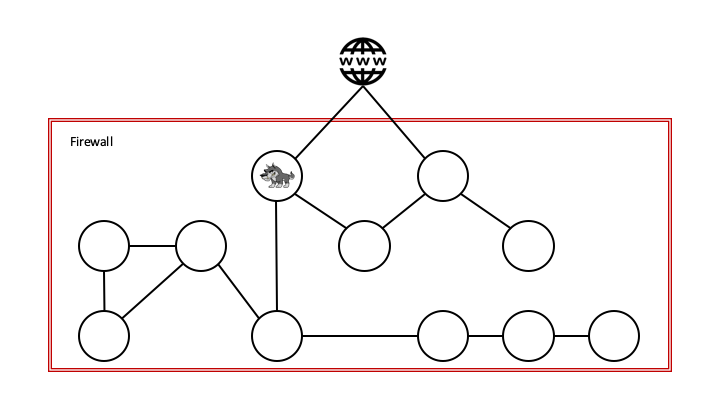
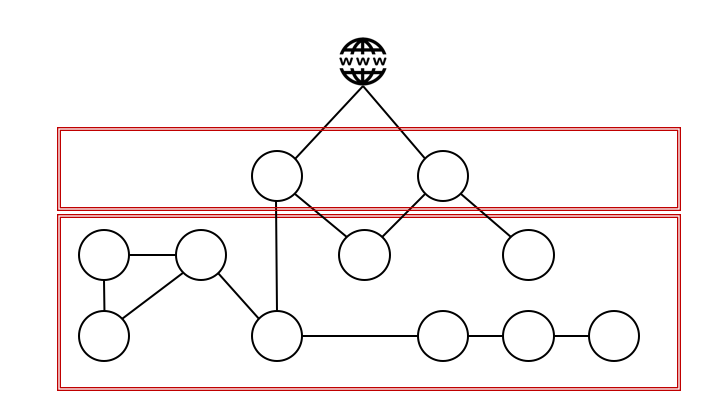
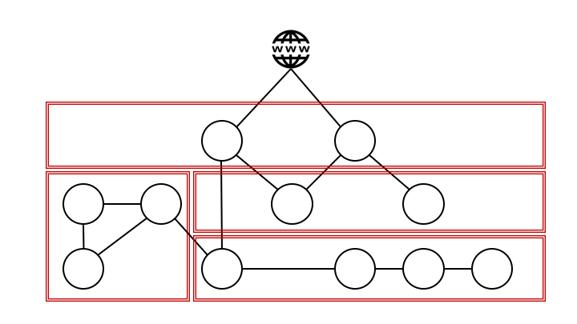

# Zero-trust background

Firewalls and zones have been our primary defense mechanism for years.
With this model we've defined a perimiter around our applications; keeping potential attackers on the inside, and to have control of what our applications are able to communicate with on the outside

The challenge with this model in a containerized world, is that our application portfolio has become more distributed, which leaves ut with more components and attack vectors.

Additionally the attack methods have become more sophisticated.
Our safety planning and solutions has to be able to adress:
- What happens if an attacker is able to breach our perimiter?

Since our application's architecture is based primarily on an outer defence layer, it will be a relatively simple task for an attacker that is alreay on the inside to compromise other applications within the same perimiter.
Most applications have implementet further safety mechanisms, but those who rely solely on the safety perimiter are extremely vulnerable.

We've addressed this problem using network segmentation; applications with the same safety level and affiliation are grouped together behind separate firewalls.

The challenge remains the same, though; a compromized application could mean a compromized zone.

The next level of security using this methodology is microsegmentation and a zone model where applications and services are grouped in even smaller and more specific zones, givig a potential attacker an even smaller attack surface given a successfull attack.

Continuing this methodology, the inevitable conclusion will be a perimiter around each individual application.

Once each application has its own perimiter, the next thing to address is: 
- What if the network itself is compromized?
- Are there attackers on the inside that can listen to or spoof traffic?

We know this is the case on unsafe networks, like the internet, but here we've been using other safety mechanisms ensuring that we can safely send sensitive information like bank and health data.
It is no longer a safe assumption that there are no attackers in our own datacenters, our private cloud or in the public cloud, so we have to implement mehanisms to secure the communication between our applications even here.

We need to base our transportation security on authentication and authorization between all services, so that we can be cryptographically certain that both the sender and the receiver are who they claim they are.
Each endpoint is given a cryptographic identity in form of a certificate proving their identiy. This gives us the ability to make policies and control service to service communication based on identity.
