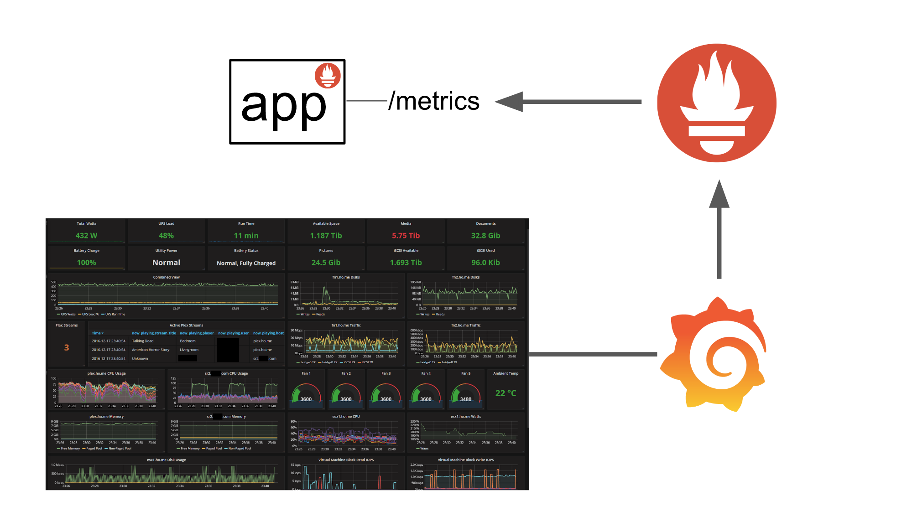

# Metrics

Prometheus is used to scrape metrics from the pod. You have to add Prometheus in your [NAIS manifest](../in-depth/nais-manifest.md) to enable scrape.

Each app that have scraping enabled can use the default Grafana dashboard [nais-app-dashboard](https://grafana.adeo.no/dashboard/db/nais-app-dashboard), or create theire own.

## NAIS manifest config

```text
prometheus:
  enabled: false # if true the pod will be scraped for metrics by prometheus
  path: /metrics # Path to prometheus-metrics
```

PS: Prometheus is optional

### JVM Application

If you are building an app on the JVM you can use Prometheus' own [Java client library](https://github.com/prometheus/client_java). Make sure to enable scraping in the NAIS manifest.

We also recommend to export the default metrics.

```text
DefaultExports.initialize();
```

## Push metrics

If you don't want to just relie on pull metrics, you can push data directly to InfluxDB via [Sensu](https://sensu.io/).

This is easily done by writing to the Sensu socket.

```text
sensu.nais:3030
```

Remember to format the data as [Influxdb syntax](https:/s.influxdata.com/influxdb/v1.5/write_protocols/line_protocol_tutorial/#syntax).

## Overview



