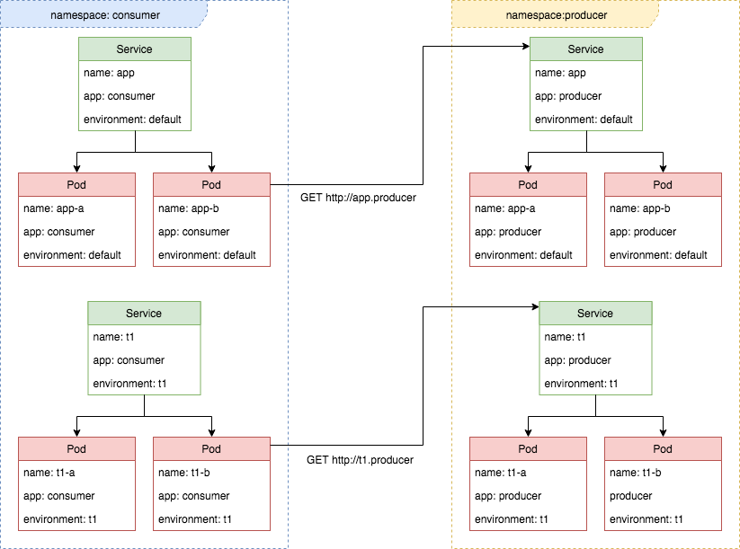

# Service Discovery

## TLDR
There is one namespace per application, and one deployment per environment. 
The default deployment for every application is named: `app`

Example: foreldepengesoknad-api

| env     | url                                 |
| ------- | ----------------------------------- |
| default | `http://app.foreldepengesoknad-api` |
| t1      | `http://t1.foreldepengesoknad-api`  |

## Overview

## Multiple environments
If you need multiple different application instances running at the same time,
you can specify `environment` in deployment request like this:

<pre><code>
{
  "application": "applicationName", // application name
  "version": "2",                   // version of your application
  "zone": "sbs",                    // what zone your application runs in
  <b>"environment": "t1"</b>,              // optional: defaults to 'default'
  "fasitEnvironment": "t1",         // fasit environment
  "fasitUsername": "brukernavn",    // fasit username
  "fasitPassword": "passord",       // fasit password
  "manifesturl": "https://..."      // optional: defaults to using internal nexus with groupid=nais, artifactid=<appname>, version=<version>, type=yaml
}
</code></pre>

To communicate with this application instance you'd have to use `http://t1.applicationName/`

## Making the same code work in multiple environments
As urls now contain environment we suggest you include som logic in your code to avoid making code changes for every environment your
application runs in. The current environment an application is running in is injected at deploytime as the environment variable
`APP_ENVIRONMENT` which can be used to construct urls.

### Python example:
<pre><code class="lang-python">def assemble_url(applicationName):
  env = os.environ['APP_ENVIRONMENT']
  deploy = env if env != "default" else "app"

  return "{}.{}".format(env, applicationName)

# Running in <b>t1</b> would yield:
>>> assemble_url('applicationName')
't1.applicationName'

# Running in <b>default</b> would yield:
>>> assemble_url('applicationName')
'app.applicationName'</code></pre>
